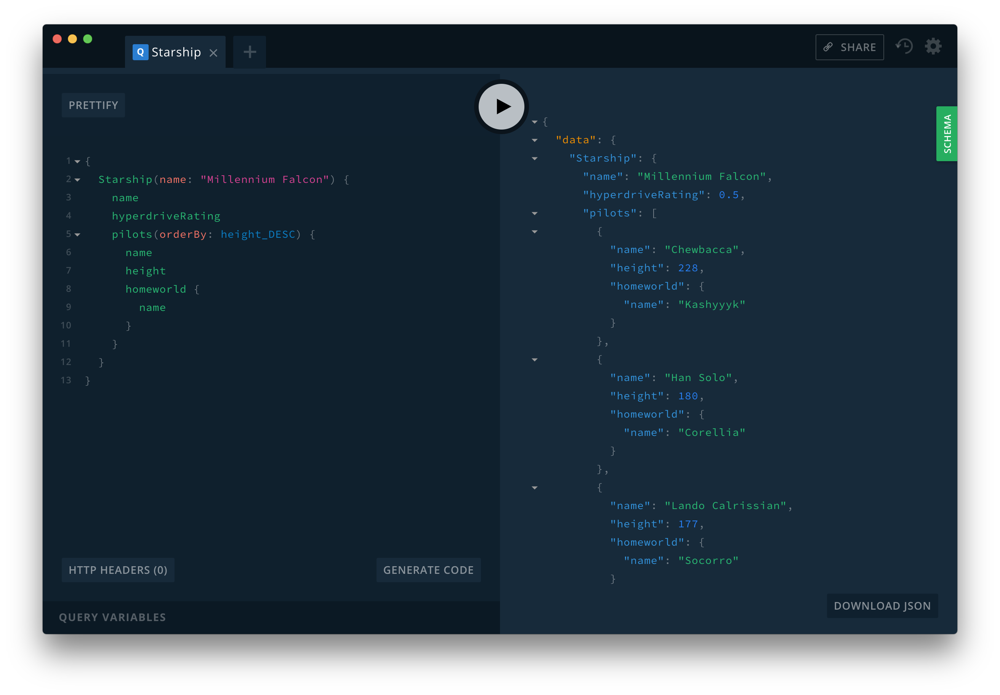

Welcome to the Reaction NEXT platform.

## Overview

This project is the foundation for the next generation of Reaction Commerce
software.

## Features

* A microservices based architecture.
* Docker based development environment.
* Kubernetes ready.

### Project Structure

Reaction NEXT is build upon a microservices architecture. The
[reaction-next][8] project is a shell that contains build tools to bootstrap
the environment.

Each microservice will be cloned as a child directory within this project.

## Prerequisites

* [Git][5]
* [Docker][0] | [Docker for Mac][1] | [Docker for Windows][2]
* [NodeJS][3]
* [Yarn][4]
* A [Github][6] account with a [configured SSH key][7]


## Getting started

First, clone this repository.

```sh
git clone git@github.com:reactioncommerce/reaction-next.git

cd reaction-next
```

#### Bootstrapping

From within the project directory run:

```sh
make
```

This process may take some time. Behind the scenes `make` is

* checking that dependencies are present
* cloning the sub projects
* downloading Docker images
* building custom, project Docker images
* starting services

#### Using your new development environment

Reaction NEXT ships with [GraphQL Playground][9] out of the box.



When the initial `make` command is complete you can use [GraphQL Playground][9]
to verify that things are running.


View http://localhost:4000 to get started.


## Project Commands

These commands are used to control the system as a whole. Please refer to each
project README for details on that service.

| Command      | Description |
| ------------ | ----------- |
| `make`       | 0-60: Boostraps the project from ground up.
| `make stop`  | Stops all containers.
| `make start` | Starts all containers.
| `make rm`    | Removes all containers. Volumes are not removed.
| `make clean` | Removes all containers, networks, and volumes. Any volume data will be lost.

## License

Copyright © [GNU General Public License v3.0](./LICENSE.md)


[0]: https://www.docker.com/get-docker "Docker"
[1]: https://www.docker.com/docker-mac "Docker for Mac"
[2]: https://www.docker.com/docker-windows "Docker for Windows"
[3]: https://nodejs.org "NodeJS"
[4]: https://yarnpkg.com/en/docs/install "Yarn"
[5]: https://git-scm.com/ "Git"
[6]: https://github.com/ "Github"
[7]: https://github.com/settings/keys "Github SSH Keys"
[8]: https://github.com/reactioncommerce/reaction-next "Reaction NEXT"
[9]: https://github.com/graphcool/graphql-playground "GraphQL Playground"
